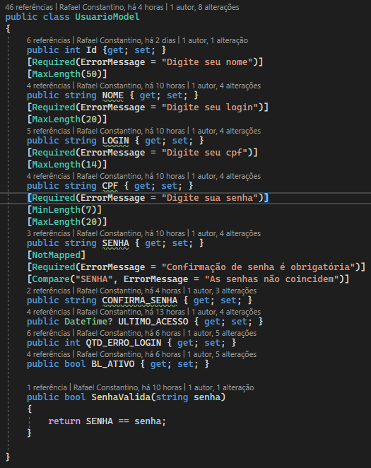
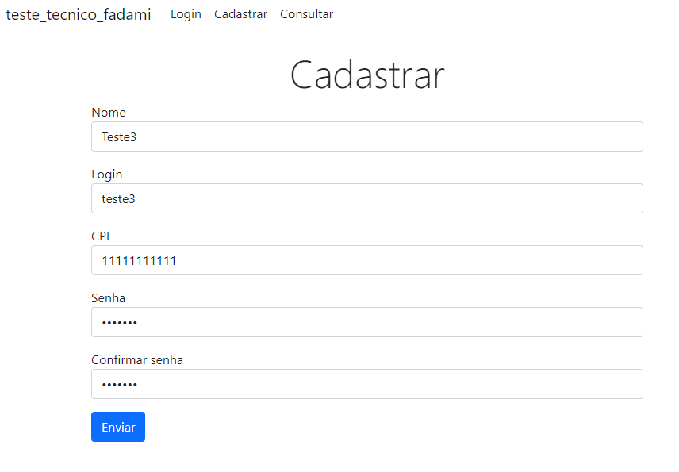
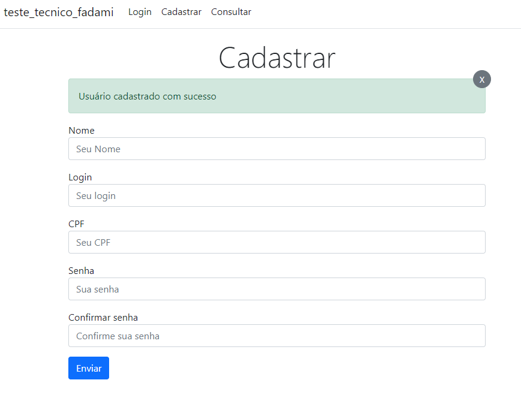
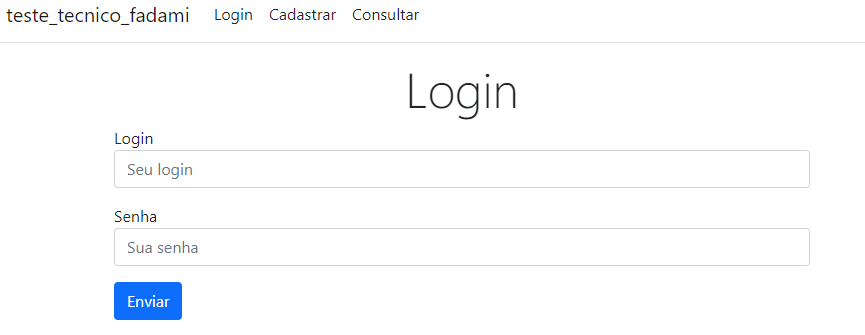
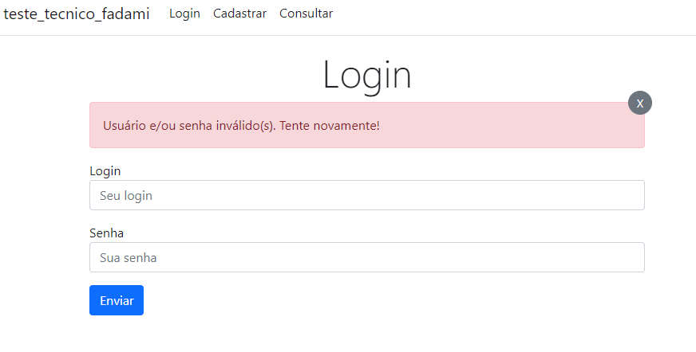
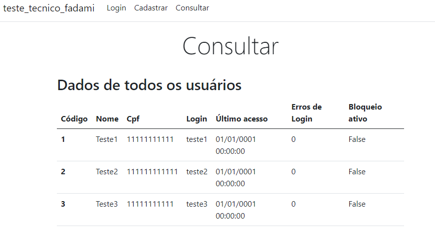
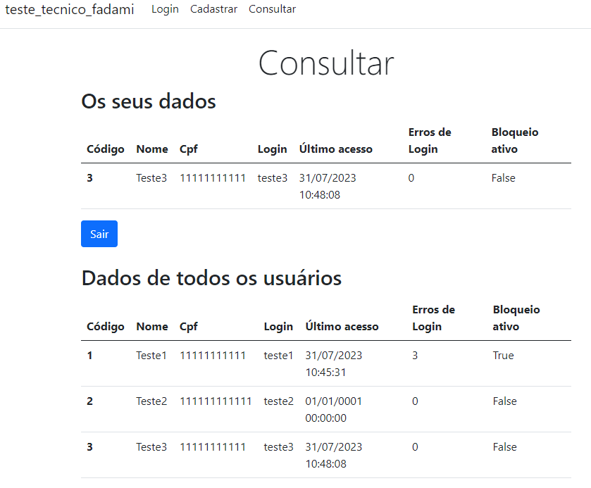

# Prova de conhecimento Fadami

## Model de Usuario:

## Tela de Cadastro:

## Tela de Cadastro com cadastro realizado com sucesso:

## Tela de Login

## Tela de Login com login incorreto:

## Tela de Consultar (sem usuário logado, com seus dados guadados na sessão):

## Tela de Consultar com os dados do usuário logado guardado na sessão:
